<!-- All images below are either stored in ./assets (generated by .github/workflows/profile.yml)
     or are shields.io badges. No other third-party image services are used. -->

<p align="center">
  
</p>

<p align="center">
  
</p>

<p align="center">
  <a href="https://www.linkedin.com/in/YOUR-LINKEDIN/"></a>
  <a href="mailto:YOUR-EMAIL@example.com"></a>
  <a href="https://owasp.org/www-project-webshield-library/"></a>
</p>

---

## 🧑‍💻 About Me

<p align="center">
  
  
  
</p>

<table>
  <tr>
    <td width="50%" valign="top">

### 🔐 What I build

- **Single Sign-On**: SAML 2.0, OIDC & OAuth 2.0 federation
- **Passwordless auth**: FIDO2, WebAuthn & passkeys
- **Multifactor authentication** at global-bank scale
- **PingFederate** custom adapters
- **Full-stack apps**: Java / Spring Boot + React

</td>
    <td width="50%" valign="top">

### 🏆 Highlights

- 🏦 Engineering the **enterprise authentication platform** at **JPMorgan Chase**, serving every line of business
- 🔑 Built a **passkey proof-of-concept** that shaped a firmwide passwordless roadmap
- ⚙️ Authored a **deployment-automation library** adopted by **12+ teams**
- 🦉 **Project Leader** of the OWASP Web Shield Library

</td>
  </tr>
</table>

> 💬 **Ask me about** SSO, federation, passkeys, OAuth/OIDC flows, PingFederate, Spring Boot, or application security.

---

## 🦉 Featured Project: OWL · OWASP Web Shield Library

<p align="center">
  <a href="https://github.com/OWASP/www-project-webshield-library">
    
  </a>
</p>

<p align="center">
  <a href="https://owasp.org/www-project-webshield-library/"></a>
  <a href="https://github.com/OWASP/www-project-webshield-library/stargazers"></a>
  <a href="https://github.com/OWASP/www-project-webshield-library/releases"></a>
  <a href="https://www.npmjs.com/package/@owasp-core/owl"></a>
  
</p>

A **developer-first JavaScript security toolkit** that maps security controls directly to the **OWASP Top 10 (A01–A10)**. It has a framework-agnostic core and a full **React adapter**, so secure-by-default code is one `npm install` away.

<table>
  <tr>
    <td width="55%" valign="top">

| # | OWASP Category | OWL Module |
|:--:|:--|:--|
| A01 | Broken Access Control | `RBACManager` · `ACLManager` |
| A02 | Cryptographic Failures | `CryptoManager` (AES-256-GCM) |
| A03 | Injection | `InputSanitizer` · `InputValidator` |
| A04 | Insecure Design | `ThreatModelGuard` |
| A05 | Security Misconfiguration | `HardeningReporter` |
| A06 | Vulnerable Components | `DependencyRiskScanner` |
| A07 | Auth Failures | `AuthManager` · `TokenManager` |
| A08 | Integrity Failures | Secure `HTTPClient` |
| A09 | Logging & Monitoring | Security monitoring |
| A10 | SSRF | `SSRFGuard` |

</td>
    <td width="45%" valign="top">

**⚡ Quick start**

```bash
npm install @owasp-core/owl
```

```jsx
<AuthGate fallback={<SignIn/>}>
  <PermissionGate
    action="read"
    resource="reports"
    fallback={<Forbidden/>}>
    <Reports/>
  </PermissionGate>
</AuthGate>
```

</td>
  </tr>
</table>

<p align="center">
  <a href="https://github.com/OWASP/www-project-webshield-library"></a>
  <a href="https://github.com/cybersreejith/www-project-api-security-testing-framework"></a>
</p>

<p align="center">
  <a href="https://owasp.org/www-project-webshield-library/"><b>🌐 Project Page</b></a> &nbsp;•&nbsp;
  <a href="https://github.com/OWASP/www-project-webshield-library"><b>📦 Repository</b></a> &nbsp;•&nbsp;
  <a href="https://github.com/OWASP/www-project-webshield-library/issues"><b>🐛 Issues</b></a> &nbsp;•&nbsp;
  <b>⭐ Star it if it helps you!</b>
</p>

---

## 🛠️ Tech Stack

**Languages & Frameworks**

<p>
  
  
  
  
  
  
  
  
  
</p>

**Data, Cloud & DevOps**

<p>
  
  
  
  
  
  
  
  
  
  
  
</p>

**Identity & Security**

<p>
  
  
  
  
  
  
  
  
  
</p>

---

## 📊 GitHub Stats

<p align="center">
  
  
</p>

<p align="center">
  
</p>

<p align="center">
  
</p>

---

## 🐍 Contribution Snake

<p align="center">
  <picture>
    <source media="(prefers-color-scheme: dark)" srcset="./assets/github-snake-dark.svg"/>
    <source media="(prefers-color-scheme: light)" srcset="./assets/github-snake.svg"/>
    
  </picture>
</p>

---

## 🔐 Security Principles I Build By

<table>
  <tr>
    <td align="center" width="25%">🔒<br/><b>Zero Trust</b><br/><sub>Every request proves itself</sub></td>
    <td align="center" width="25%">🪪<br/><b>Passwordless First</b><br/><sub>Phishing-resistant over shared secrets</sub></td>
    <td align="center" width="25%">🧾<br/><b>Standards Over Snowflakes</b><br/><sub>SAML, OIDC, OAuth, FIDO2 by the spec</sub></td>
    <td align="center" width="25%">🧩<br/><b>Reusable Building Blocks</b><br/><sub>Automate once, adopt everywhere</sub></td>
  </tr>
</table>

<p align="center"><i>"Authenticate strongly, authorize minimally, federate carefully, and never trust a token you didn't verify."</i></p>

---

## 🤝 Let's Connect

<p align="center">
  Always happy to talk about <b>identity, federation, passkeys and open-source security</b>.<br/>
  Want to contribute to <a href="https://github.com/OWASP/www-project-webshield-library"><b>OWL 🦉</b></a>? Pick an issue. Contributors are welcome!
</p>

<p align="center">
  
</p>
